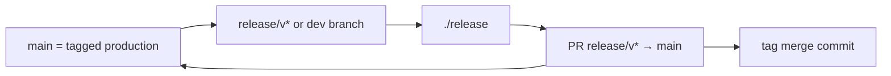

# Plan: production-trunk hub release (wrapped complexity)

**Status:** in progress (R–F + V2 done; **M** v0.2.0 blocked — see [M-v0.2.0-closeout-notes.md](M-v0.2.0-closeout-notes.md); **F5/V1** `release signed` needs human `Released-by:` audit tree)  
**Charter class:** F (process / human surface)  
**Version class at ship:** **minor** (orchestrator + branch policy; gates unchanged)  
**Outcome:** Human workflow is seven lines; ADR 0022/0038–0040 guarantees stay inside `./release` and `/release`.

## Human contract (normative target)

1. **Never commit to `main`** (only merges land there — branch protection).
2. **`main` HEAD = last tagged release** (no unreleased commits on `main`).
3. **Branch from `main`.**
4. **Do work on that branch** (feature branches may merge into it).
5. **Merge `main` into your branch** when other releases ship.
6. **Run `./release`** when ready (from your **release line branch**, not from memory).
7. **Follow printed instructions** — `RELEASE:NOT_MET` or success; no quizzes on deterministic legs.

**Preserved goals (not negotiable):** semver tag on merge commit; migration chain from last shipped tag; `hub-release-record.json` + release notes on release commit; tag gate + `verify-deep` at tag commit; GitHub Actions on tag push ([ADR 0022](https://github.com/richardpickett/Natural-Language-Coding/blob/main/adrs/0022-hub-release-fail-early.md), [0039](https://github.com/richardpickett/Natural-Language-Coding/blob/main/adrs/0039-single-command-human-surfaces.md), [0038–0040](https://github.com/richardpickett/Natural-Language-Coding/blob/main/adrs/0040-process-preflight-remediation.md)).

---

## In scope / out of scope

| In | Out |
| --- | --- |
| `scripts/nlc-release.sh`, `tools/nlc_release_*.py` | Adopter `./nlc` release surfaces |
| New ADR “production trunk” + amend ADR 0022/0040 wording | Rewriting `release.yml` pipeline semantics |
| `docs/adoption/RELEASE.md`, `.agents/skills/release/SKILL.md` | GitHub org-wide branch protection (document + optional script check only) |
| Fitness binders + landmines | Deleting remote tags without retag gate |
| v0.2.0 closeout migration steps (section M) | Feature development on `main` (forbidden by policy, not by git) |

---

## Gate — plan acceptance (default-closed)

| Criterion | Blocking? | Pass when |
| --------- | --------- | --------- |
| Human contract matches user 7-step model | yes | Section above |
| ADR 0022 gate **order** preserved on release **branch tip** | yes | Plan rows 41–55 |
| `./release` entry from release line branch | yes | Plan rows 56–72 |
| `main` purity enforceable | yes | Plan rows 28–40 |
| Atomic steps each have stop predicate + metric | yes | Table below |
| `/release` skill matches human contract | yes | Plan rows 73–82 |

---

## Applicability register

| Norm | Applies |
| ---- | ------- |
| `CHARTER.md` §6 class F | Yes |
| ADR 0022 fail-early order | Yes — relocate “on main” reads to **shipped baseline ref** |
| ADR 0039 one command + resume | Yes — extend resume for **dev branch** source |
| ADR 0010 gate after generate | Yes — per implementation row |
| ADR 0018 human gaps | Yes — `RELEASE:NOT_MET` only |
| ADR 0040 preflight | Yes — **main purity** + **release line** detection |
| `operation-verdict-standard` §2 | Yes — skill + ADR acceptance criteria |
| `tools/ci_fitness.py` | Yes — prove |

---

## Architecture (one diagram)

**Source-of-truth shift:** prepare leg runs on **`RELEASE_SOURCE_BRANCH`** (current branch if valid release line, else auto `release/vX.Y.Z` created from `main` + merged work). **`main`** is read only for shipped baseline (tag + `nlc-version.json` at tag), not for carrying unreleased feature commits.

---

## Execution index

| Block | Steps | Purpose |
| ----- | ----- | ------- |
| **R** Ratify | R1–R6 | ADR + charter pointer |
| **P** Policy docs | P1–P8 | Human-visible contract |
| **G** Gates code | G1–G22 | Preflight, context, purity |
| **O** Orchestrator | O1–O24 | `nlc-release.sh` behavior |
| **A** Agent skill | A1–A6 | `/release` simplification |
| **F** Fitness | F1–F8 | Binders + landmines |
| **M** Migrate v0.2.0 | M1–M10 | Unstick current ship |
| **V** Verify | V1–V6 | Prove compile |

**Convention:** Each step = **one atomic action**. Stop if stop predicate FAIL; fix; redo same step.

---

## R — Ratify

| ID | Atomic action | Touch | Stop predicate |
| -- | ------------- | ----- | -------------- |
| R1 | Draft ADR `0041-hub-release-production-trunk.md` (Context: user contract; Decision: main=tagged only, release line carries work; Consequences: script/skill). | `adrs/0041-hub-release-production-trunk.md` | File exists; cites 0022/0039/0040 |
| R2 | Add **Rejected**: “feature integration on main between tags”. | same | Section present |
| R3 | Add acceptance criterion: `./release` from `release/v1.0.0` with dirty forbidden files MET dry-run prepare. | same | Testable sentence in ADR |
| R4 | Human sets `Ratified-by:` in ADR frontmatter (or charter §6 record). | same | Non-empty ratification line |
| R5 | Run `bbp-recorder` memo or link ADR in `docs/adoption/RELEASE.md`. | `RELEASE.md` | Link to 0041 |
| R6 | Update `docs/adoption/RELEASE-SINGLE-PATH-PLAN.md` status footnote “superseded by 0041 trunk plan”. | plan doc | Status line updated |

---

## P — Policy docs

| ID | Atomic action | Touch | Stop predicate |
| -- | ------------- | ----- | -------------- |
| P1 | Replace `RELEASE.md` “What `./release` does” with **7-step human contract** + “tool handles the rest”. | `docs/adoption/RELEASE.md` | No “choose patch/minor” operator step |
| P2 | Document **`main` purity rule**: `git rev-parse main` equals `v*.*.*^{commit}` OR release_fail with reset instructions. | same | One paragraph + command example |
| P3 | Document **release line branches**: `release/v*`, optional `--branch` / auto-detect from current branch name. | same | Branch naming table |
| P4 | Document **sync step 5**: `git fetch origin main && git merge origin/main` on release line (no `./release` subcommand). | same | Copy-paste block |
| P5 | Document **single flags table**: `--bump`, `--no-push`, `--dry-run`, `--from-branch` (if added). | same | Table matches script |
| P6 | Add **GitHub branch protection** checklist (main: require PR, no direct push). | same or `docs/adoption/BRANCH-PROTECTION.md` | Checklist ≥3 items |
| P7 | Add **Anti-patterns** table (v0.2.0 lessons: fix after merge on main, work only on main, tag_ready without gate MET). | same | ≥4 rows |
| P8 | Sync `.cursor/skills/release/SKILL.md` from `.agents/skills/release/SKILL.md` after A-block. | symlink/copy | Content match |

---

## G — Gates code (Python)

| ID | Atomic action | Touch | Stop predicate |
| -- | ------------- | ----- | -------------- |
| G1 | Add `main_head_is_tag_commit(remote, base) -> bool` in `tools/nouns/release_tags/` or new `release_main_purity.py`. | new module | Unit: true when HEAD=tag |
| G2 | Add CLI `python3 tools/nlc_release_main_purity.py --check`. | thin wrapper | Exit 0 on pure main |
| G3 | On NOT_MET, emit `RELEASE:NOT_MET` + “main has commits beyond last tag” + `git log tag..main --oneline`. | same | stderr shape ADR 0018 |
| G4 | Wire purity check into `nlc_release_preflight.py` **before** version coherence when branch is `main`. | preflight noun | Preflight fails on impure main |
| G5 | When branch is `release/v*`, **skip** main purity (release line carries target version). | preflight | Test: release branch passes |
| G6 | Add `resolve_release_source_branch(branch, bump) -> release/vX.Y.Z` in `nlc_release_context.py`. | context noun | Returns name or error |
| G7 | Rule: if current branch matches `release/v*`, source = current; elif `main`, create/checkout `release/v*` from main **only if main pure**; else NOT_MET. | context | Documented in docstring |
| G8 | Add `commits_on_main_not_on_release(main, release_branch)` for agent diagnostics (0040 disambiguation). | context | JSON/list output |
| G9 | Extend `nlc_release_resume.py` `detect()`: phase `prepare` when release branch exists locally with unpushed work (optional subphase). | resume | JSON field documented |
| G10 | Add `phase=dev_release` or use `prepare` + `release_branch` hint when on `release/v*` without remote push. | resume | `assert-release-resume-invariant-passes` updated |
| G11 | Ensure `stale_release_branches` still MET when merged without record. | resume | Existing landmine PASS |
| G12 | `release_target_gate`: run with `--target` from **release branch** version file peek. | no change if already | MET on sample |
| G13 | `nlc_release_notes.py`: `--to` defaults to **release source HEAD** not main when env set. | notes | One test invocation |
| G14 | Add env `NLC_RELEASE_SOURCE_BRANCH` override for CI tests. | script + docs | Documented in RELEASE.md |
| G15 | Preflight: on release branch, allow `json_ver > shipped_ver` (already partial). | preflight | Remove main-only bump confusion in messages |
| G16 | Add remediation template “merge main into release branch” in `release_remediate.py`. | remediator | Template callable |
| G17 | Landmine `assert-release-main-purity-fails.py` (dirty main fixture → NOT_MET). | new assert | ci_fitness wired |
| G18 | Landmine `assert-release-main-purity-passes.py` (fixture pure main → MET). | new assert | ci_fitness wired |
| G19 | Register landmines in `tools/nouns/ci_fitness/ci_fitness.py`. | ci_fitness | Names in suite |
| G20 | Hub entrypoints fitness if new tool path required. | fitness-requirements | MET |
| G21 | Run `python3 tools/nlc_release_main_purity.py --check` on clean tagged main → MET. | manual | Exit 0 |
| G22 | Run same on main ahead of tag → exit 1. | manual | Exit 1 |

---

## O — Orchestrator (`scripts/nlc-release.sh`)

| ID | Atomic action | Touch | Stop predicate |
| -- | ------------- | ----- | -------------- |
| O1 | Replace `ensure_on_main` with `ensure_release_source`: checkout **release line** per G7 rules. | script | No unconditional `checkout main` at prepare start |
| O2 | At start: `git fetch origin main --tags`. | script | Present in prepare + tag legs |
| O3 | If on `main` and purity NOT_MET → `release_fail` (do not create branch). | script | Grep: purity call |
| O4 | If on `main` and purity MET and no `release/v*` yet → `git checkout -b release/v$(peek bump)`. | script | Branch created |
| O5 | If on `release/v*` → stay; pull if `-u` tracks remote. | script | log line |
| O6 | First `verify-deep`: run at **shipped baseline** — checkout **tag commit** detached or use `nlc.py verify-deep` with `--ref last_tag` if supported; else document “run from main at tag” via temporary checkout. | script + nlc | Gate order 0022 preserved |
| O7 | If O6 requires tag checkout: restore release branch after verify. | script | Branch unchanged after step |
| O8 | `release_target_gate` after bump peek on **release branch**. | script | Order: purity → source branch → target gate |
| O9 | Notes draft `--to HEAD` on **release branch**. | script | MET or NOT_MET |
| O10 | Version bump on **release branch** only (unchanged logic, wrong branch impossible). | script | `nlc-version.json` not on main |
| O11 | Second `verify-deep` on release branch HEAD. | script | exit on fail |
| O12 | Auto commit + push **release branch** (existing). | script | unchanged |
| O13 | Merge poll / NOT_MET (existing). | script | unchanged |
| O14 | Tag leg: `ensure_on_main` only for **fetch**; tag gate on merge commit (unchanged). | script | tag_ready → cmd_finish |
| O15 | Remove remediation default “checkout main” where it contradicts trunk; use “checkout release/v*”. | `release_fail()` | Fix lines cite release branch |
| O16 | Add `--from-branch NAME` flag to force source (optional). | script | `--help` lists flag |
| O17 | Default `--bump keep` on resume; `--bump` required when **creating new** `release/v*` from pure main. | script | Doc + behavior |
| O18 | When creating new release from main: require explicit `--bump patch|minor|major` (NOT keep). | script | keep from pure main → release_fail |
| O19 | Print **human step 6 only** banner: “Merge PR in GitHub when link appears; re-run ./release”. | script | One banner string |
| O20 | `cmd_release` prepare path: never merge feature work onto main in script. | script | No `git merge main` into main |
| O21 | Dry-run test: pure main + `--bump minor` prints would-create `release/v*`. | manual | Log contains branch name |
| O22 | Dry-run test: on `release/v0.2.0` skips main purity failure. | manual | No checkout main |
| O23 | Bash syntax `bash -n scripts/nlc-release.sh`. | manual | exit 0 |
| O24 | Grep script: no `Choice [p/m/M/k]`, no `Press Enter when merged`. | manual | Only retag `read -r` |

---

## A — Agent `/release` skill

| ID | Atomic action | Touch | Stop predicate |
| -- | ------------- | ----- | -------------- |
| A1 | Rewrite skill **Procedure** to 7-step human contract (user-facing). | `.agents/skills/release/SKILL.md` | Gate table still default-closed |
| A2 | Step 1A closeout: run on **release line branch** OR commit there; **never** commit ship batch to `main`. | skill | Explicit “do not commit to main” |
| A3 | Step 0 resume: if `prepare`, agent ensures user on `release/v*` or creates via `./release --bump …` from pure main. | skill | Phase table updated |
| A4 | Step 6: `./release --bump keep` on release branch; new release `./release --bump minor` from pure main only. | skill | Matches O17–O18 |
| A5 | Remove “interactive prompts” language (orchestrator non-interactive). | skill | grep interactive → 0 |
| A6 | Gate row **Ship branch**: pass when on `release/v*` or pure `main` about to create release line. | skill | Table row updated |

---

## F — Fitness

| ID | Atomic action | Touch | Stop predicate |
| -- | ------------- | ----- | -------------- |
| F1 | Extend `fitness_adr_0039_release_binder.py`: script calls `nlc_release_main_purity` or equivalent. | binder noun | VIOLATION if missing |
| F2 | Binder: `RELEASE.md` contains “never commit to main” or production trunk section. | binder | VIOLATION if missing |
| F3 | Binder: ADR 0044 linked from RELEASE.md. | binder | After R5 |
| F4 | Run `python3 tools/fitness-adr-0039-release-binder.py` → MET. | — | RESULT:MET |
| F5 | Run `python3 tools/ci_fitness.py` → CI:MET. | — | exit 0 |
| F6 | Run `assert-release-resume-invariant-passes.py` → MET. | — | MET |
| F7 | Add binder row forbidding `ensure_on_main` at prepare **without** prior purity check (grep). | binder | Optional string check |
| F8 | Update `integrity/hub-x4-remainder.json` if new assert tools added (hub policy). | json | Valid if required by fitness |

---

## M — Migrate / close v0.2.0 (one-time)

| ID | Atomic action | Touch | Stop predicate |
| -- | ------------- | ----- | -------------- |
| M1 | `git fetch origin main --tags`; record `last_tag`, `main` SHA, `release/v0.2.0` if exists. | — | Notes in chat or TODO |
| M2 | If tag `v0.2.0` missing and merge commit known: list tag gate failures (`nlc_release_tag_gate.py --check`). | — | Gap list |
| M3 | Cherry-pick or rebuild **release/v0.2.0** so merge commit includes record + notes + verify-deep MET. | git | Tag gate MET on merge SHA |
| M4 | If main is ahead of merge: **do not** fix only on main; fix on release branch + re-merge OR new PR. | policy | Document choice |
| M5 | Merge production-trunk PR (this plan’s code) to `main` **via release branch** if main must stay pure. | git | Main purity MET |
| M6 | `./release --bump keep` → `RELEASE:TAG_PUSHED v0.2.0`. | — | Success line |
| M7 | Confirm `git ls-remote origin v0.2.0` exists. | — | Ref exists |
| M8 | Confirm GitHub Release workflow success (optional `gh run list`). | — | User visible |
| M9 | Delete stale `release/v0.2.0` branches local+remote after complete. | git | resume phase `complete` |
| M10 | Human `Released-by:` when using release-audit (if applicable). | — | User action |

---

## V — Verify (compile)

| ID | Atomic action | Touch | Stop predicate |
| -- | ------------- | ----- | -------------- |
| V1 | Run F4–F6 block. | — | All MET |
| V2 | Scenario test doc: `docs/adoption/RELEASE-TRUNK-SMOKE.md` with commands pure main → release branch → dry-run. | new doc | ≥5 command blocks |
| V3 | Execute smoke on local clone (user or agent). | — | dry-run PASS |
| V4 | `bbp-reviewer` pass on ADR 0041 + script diff (cite R/C/P). | — | No unbound blockers |
| V5 | Update inference record / FINDINGS only if user approved (ship batch). | integrity | Optional |
| V6 | Mark this plan **Status: executed** in frontmatter. | this file | Date + link to ADR 0044 |

---

## Bindings (PLANIT step 4)

| Statement | ADR / norm |
| --------- | ---------- |
| One command `./release` | 0039 |
| Gate order on release line + tag commit | 0022, 0038 |
| NOT_MET remediation | 0018, 0040 |
| Main = production at tag | **0044** (new) |
| Binder after script | 0010 |
| Agent closeout not on main | 0020, 0041 |

---

## Verdict — Planit intake gate: **PASS**

(Outcome: production-trunk UX; scope bounded; tier T2; multi-step staged blocks R→V.)

## Verdict — Planit plan audit: **PASS**

| Check | Result |
| ----- | ------ |
| GATE-STD on deliverables | PASS — ADR, skill, script, binders named |
| Unbound work | None — each row touches artifact |
| ADR 0022 order | PASS — O6–O11 explicit |
| God-noun | None |
| Wrong charter class | F correct |

**Note:** O6 (verify-deep at last tag without polluting main) is highest risk; if `nlc.py verify-deep` cannot target a ref, plan requires a thin `--at-ref` flag (add sub-step O6a in execute).

## Verdict — Planit bind gate: **PASS**

## Next step for human

Execute **R1** (draft ADR 0041), then proceed in order **R→P→G→O→A→F→M→V**. After each step, check stop predicate; on FAIL, fix and repeat.

**Do not** batch-commit until **F5** MET unless M-block requires intermediate ship.
