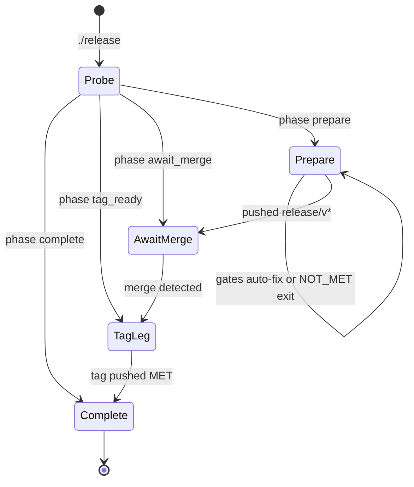

# Plan: single-path hub release (detect → auto-fix → exit with remediation)

**Status:** executed (UX); branch policy superseded by [ADR 0044](../../adrs/0044-hub-release-production-trunk.md) + [RELEASE-PRODUCTION-TRUNK-PLAN.md](RELEASE-PRODUCTION-TRUNK-PLAN.md)  
**Charter class:** F (process / human surface) — amends UX of [ADR 0018](../../adrs/0018-human-cli-interview-on-gap.md) *for hub `./release` only*: deterministic legs use **remediation + exit**, not choice menus.  
**Bindings:** [ADR 0039](../../adrs/0039-single-command-human-surfaces.md), [ADR 0022](../../adrs/0022-hub-release-fail-early.md), [ADR 0040](../../adrs/0040-process-preflight-remediation.md), [RELEASE.md](RELEASE.md)

## Outcome (one line)

**One command** (`./release` from repo root, optionally with flags) runs a **state machine** with **no interactive questions** on deterministic legs; **auto-fix** safe gaps; on **NOT_MET** print **copy-paste remediation** and **exit 1**.

Chat entry **`/release`** remains agent closeout + `./release` — not a second ship path.

---

## In scope / out of scope

| In | Out |
| --- | --- |
| `scripts/nlc-release.sh`, `tools/nlc_release_*.py` remediation emitters | Adopter `./nlc` surfaces (separate ADR 0017/0018) |
| `.agents/skills/release/SKILL.md`, `docs/adoption/RELEASE.md` | Deleting git tags on remote without explicit env (retag stays gated) |
| Fitness binders (ADR 0039) for “no quiz” invariants | GitHub PR merge approval (human in GitHub UI) |
| Polling merge via `gh` when available | Rewriting `release.yml` artifact pipeline |

---

## Applicability register (compressed)

| Norm | Applies |
| ---- | ------- |
| ADR 0039 one command | Yes — collapse aliases to `./release` only in docs |
| ADR 0022 gate order | Yes — unchanged order; remove *questions* between gates |
| ADR 0018 interview | Hub release: **problem + gaps + copy-paste fix**; **no Ask/Choices** when resume + tools fix the state |
| ADR 0010 gate after generate | Yes — binder tests after script changes |
| P-020 / AGENTS SSOT | Agent may commit closeout; human `Released-by:` unchanged |

---

## Target behavior (single path)



**Rules**

1. **Entry:** only `./release` (and `./release --help`). `prepare` / `finish` print one line and delegate to same `cmd_release` — no separate docs path.
2. **Branch:** on `main` for prepare; orchestrator **`git checkout main`** if dirty-only-on-release-branch and resume says prepare/tag_ready (auto, with log line).
3. **Bump class:** target = `integrity/nlc-version.json` when resume/prepare and no `--bump`; `--bump` overrides. **No** `p/m/M/k` prompt.
4. **Target preflight:** on NOT_MET, run **`--ensure-noop` once** automatically; re-check; still NOT_MET → **`nlc_release_target_preflight.py --print-agent-prompt`** + exit.
5. **Release notes:** if missing/invalid, **`--write-draft`** once; re-check; still NOT_MET → print **`python3 tools/nlc_release_notes.py --check …`** and **exact edit command**; exit (no nano loop).
6. **Release branch:** create `release/vX.Y.Z` from `main` automatically (done); never second confirm on `main`.
7. **Commit / push:** auto-commit release record + notes with fixed message **`Release vX.Y.Z`** when tree dirty on release branch; auto **`git push -u origin release/vX.Y.Z`** unless `--no-push`.
8. **Merge wait:** if `gh` available, **poll** PR `release/v* → main` every N s; on merged → tag leg. If no `gh`, print **one** block: “merge in GitHub, then re-run `./release`” (no Enter wait).
9. **Tag ready:** **no** “Continue tagging?” — run tag gate; MET → tag + push; NOT_MET → remediation exit.
10. **Retag:** still requires **`NLC_RELEASE_ALLOW_RETAG=1`** + explicit confirm (only non-deterministic destructive case).

**Flags (non-interactive contract)**

| Flag | Effect |
| ---- | ------ |
| `--bump patch\|minor\|major\|keep` | Target version (required only when bump ≠ file) |
| `--no-push` | Local only; print exact push command at end |
| `--dry-run` | Log actions, no git write |
| `--yes` | Deprecated alias for default auto behavior (document only) |

---

## Prompt inventory → action

Current `read` / `confirm` in `nlc-release.sh` → planned disposition:

| Location | Today | Plan |
| -------- | ----- | ---- |
| Release class `p/m/M/k` | Interactive | **Remove** — infer from `nlc-version.json` + `--bump` |
| Scaffold migrations? | confirm Y | **Auto** `--ensure-noop` then re-check |
| Refresh notes Changes? | confirm | **Auto** `--refresh-changes` when draft exists |
| Edit notes in EDITOR? | loop | **Remove** — NOT_MET + copy-paste |
| Create branch from non-main? | confirm | **Fail** — print `git checkout main && ./release` |
| Commit release? | confirm | **Auto** commit when dirty on release branch |
| Push branch? | confirm | **Auto** push unless `--no-push` |
| Press Enter when merged | wait | **Poll** `gh` or exit with re-run instruction |
| Continue tagging? | confirm Y | **Remove** — go straight to `cmd_finish` |
| Push tag? | confirm | **Auto** push tag after gate MET |
| Continue anyway (context)? | confirm | **Remove** — NOT_MET + remediation |
| confirm_tag_move | explicit yes | **Keep** (only destructive) |

---

## Auto-fix matrix (safe jidoka)

| Detector | Auto action | Stop if |
| -------- | ----------- | ------- |
| `release_target_preflight` NOT_MET | `--ensure-noop --target` | still NOT_MET |
| `RELEASE_NOTES` NOT_MET | `--write-draft` / `--refresh-changes` | Highlights invalid |
| `main` dirty ship files | Agent `/release` commit (skill) | CI NOT_MET |
| Wrong branch for phase | `git checkout main` | checkout fails |
| `tag_ready` | `cmd_finish` | tag gate NOT_MET |
| Shallow CI (landmine) | Already: `fetch-depth: 0` in fitness.yml | binder MET |
| Orphan `v0.1.0` / migration baseline | `resolve_shipped_version` (done) | catalog gap remains |

---

## Implementation plan (PLANIT steps)

| # | Step | Touch | Stop predicate |
| - | ---- | ----- | -------------- |
| 1 | Add **`tools/nlc_release_remediate.py`** — given NOT_MET tool + args, print ADR 0018-style block (problem, gaps, **copy-paste commands only**, no choices) | new noun + thin CLI | Unit: each gate failure emits ≥1 shell line |
| 2 | Refactor **`nlc-release.sh`** — replace `confirm` calls per inventory; add **`release_fail()`** wrapper calling remediator | `scripts/nlc-release.sh` | Grep: no `read -r -p` except retag |
| 3 | **Merge wait:** `wait_for_merge_poll()` using `gh pr view` / `gh pr list` | script + doc | Integration test with mocked `gh` or skip in CI |
| 4 | **Bump inference:** default target from `nlc-version.json`; `--bump` only when changing target | script | `./release --dry-run` prints target without prompt |
| 5 | Update **`docs/adoption/RELEASE.md`** — single path, flag table, “no second way” | doc | ADR 0039 binder MET |
| 6 | Update **`.agents/skills/release/SKILL.md`** — agent runs `./release` with `--bump keep` or inferred; no quiz translation | skill | Gate section lists zero human confirms except retag |
| 7 | **Binder:** extend `fitness-adr-0039-release-binder.py` — assert `nlc-release.sh` has no `Continue tagging` / `Choice [p/m/M/k]` | fitness | CI MET |
| 8 | **Landmine:** optional `assert-release-no-interactive-quiz.py` — rg forbidden patterns | assert | ci_fitness MET |
| 9 | **ADR** — short amendment to ADR 0039 or new ADR “Release single path” (human surface exception to ADR 0018 choices) | `adrs/` | bbp-recorder after ratification |
| 10 | Prove: `bash tools/ci-fitness.sh`; manual dry-run prepare + tag_ready replay | — | CI MET + documented smoke |

---

## Error output shape (normative)

On any blocking failure, stderr order:

1. **`RELEASE:NOT_MET`** (machine line)
2. **Problem** — one sentence
3. **Gaps** — bullet list
4. **Fix** — numbered copy-paste commands (full paths, no “or” branches unless retag)
5. **Re-run** — single line: `cd <repo> && ./release [--bump …]`

No `Ask` section when the fix is fully determined by tools.

Example (tag gate):

```text
RELEASE:NOT_MET
Problem: Merge commit is not allowed to receive tag v0.2.0 yet.
Gaps:
  - migration: installed 0.0.0 not in published catalog
Fix:
  git checkout main
  git pull origin main
  python3 tools/nlc_release_tag_gate.py --check --commit <sha> --tag v0.2.0
Re-run:
  cd /path/to/Natural-Language-Coding && ./release --bump keep
```

---

## `/release` skill alignment

| Today | Target |
| ----- | ------ |
| Human handles interactive prompts | Human only: GitHub merge click, retag env, `Released-by:` |
| Agent translates quiz | Agent runs `./release` non-interactive; parses **RELEASE:NOT_MET** blocks |
| Step 1A closeout | Unchanged — still before `./release` |

---

## Verdict — Planit intake gate: **PASS**

## Verdict — Planit plan audit: **PASS** (GATE-STD on deliverables in table)

## Verdict — Planit bind gate: **PASS** (steps bound to ADR 0039/0022/0018/0010)

## Next step

Ratify plan → execute rows **1–10** in one or two PRs (script + binder first, ADR with bbp-recorder).

**Do not implement** until user confirms plan or says “execute plan” (material hub F change — patch/minor: **minor** if behavior change documented; **patch** if only removing prompts with same gates).
